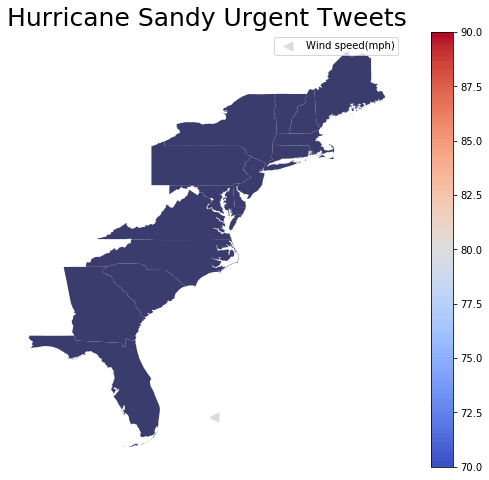

# Leveraging Social Media to Map Distress Calls
---
Authors are

- Andrew Sternick
- Nick Read 
- Preeya Sawadmanod

### Table of Contents 

* [Problem Statement](#Problem-Statement)
* [Executive Summary](#Executive-Summary)
* [Datasets](#Datasets)
* [Data Dictionary](#Data-Dictionary) 
* [Hurricane Sandy Map](#Hurricane-Sandy-Map)
* [Conclusion](#Conclusion)
* [Next Steps](#Next-Steps)

### Links
* [Project Summary](./project_summary.pdf)
* [Presentation](./presentation.pdf)

## Problem Statement

During natural disasters, social media can be a powerful tool for spontaneous organization and reporting of local conditions. Since cell towers frequently feature battery or generator backup, it is common for physically isolated people to retain connectivity for a time, even in the face of power outages.  The project is intended for disaster relief organizations and the problem we are trying to solve here is: can we leverage Social Media to map distress calls during a disaster? Twitter is the ideal social platform for our purpose to map distress calls. It requires very low bandwidth,  one-to-many communication possibilities, and geolocation features. Hurricane Sandy with its wide geographic impact and long recovery period, offers a large dataset, ideal for demonstrating the capabilities of mapping distress calls in support of disaster response. The goal of this project is to use Twitter to map distress call during Hurricane Sandy for the purpose of locating survivors needing assistance and to create a tool to assist disaster relief efforts in the United States.

## Executive Summary 

In [Data Collection](./code/1_data_collection.ipynb) we obtained tweets via two sources: the Twitter API and TwitterScraper, and combined them into a single dataframe. The Twitter API allowed us to target specific Twitter handles associated with Hurricane relief organizations. TwitterScraper allowed us to target the urban areas, time period, and keywords of our choice. Cities chosen were Boston, Philadelphia, Providence, Washington DC, Buffalo, Long Beach, Richmond, and New York City. We initially considered Toronto and Montreal in our scope as well, but ultimately decided to exclude them. The initial time period for data gathering was October 1st through November 30th. 

The next step was [Data Cleaning](./code/2_data_cleaning.ipynb). There were a significant number of duplicate tweets in the data gathered which we dropped. To reduce noise represented by people talking about the hurricane but not directly impacted, we filtered our date range, from October 27th, two days before hurricane landfall, until November 12th, when the acute crisis was past. We tokenized (split up) and lemmatized (reduced to word root) our data, and removed numbers and extraneous characters. We removed the natural language library's default list stopwords as well as an additional custom list, all of which would have been unhelpful in our modeling stage. 

In our [EDA and Preprocessing](./code/3_eda_and_preprocessing.ipynb) we plotted tweets per city, and noted we had very few tweets from Montreal, which contributed to our decision to drop Canadian cities from our scope. There was wide variation in tweet count by city, possibly owing to the differing populations, though we did not have time to include a population analysis in our EDA. We are missing tweets from NYC for October 29th, even though that was the day for which our overall tweet count was highest. This may indicate some imprecision in TwitterScraper's geocoding feature. 

We used [Word2Vec vectorizer](https://code.google.com/archive/p/word2vec/), trained on GoogleNews Vectors, to classify our tweets into binary categories of "urgent" or "non-urgent", which can be found in this [Modeling](./code/4_modeling.ipynb) notebook. The last step was to map our findings using GeoPandas and the results can be found in this [Mapping](./code/5_mapping.ipynb) notebook.

## Datasets

- Tweets that were scraped using Twitter API and TwitterScraper can found [here](https://git.generalassemb.ly/asternick/client-project/tree/master/data/tweets)
- The data can found [here](https://git.generalassemb.ly/asternick/client-project/tree/master/data). See data dictionary for more information 

## Data Dictionary 

|File name| Description|
|---|---|
|[df_1.csv](./data/df_1.csv)| This CSV file includes all data obtained from TwitterScraper|
|[df_2.csv](./data/df_2.csv)| This CSV file includes all data obtained from Twitter API|
|[df_new.csv](./data/df_new.csv)| This CSV file includes all data combined together from TwitterScraper and Twitter API|
|[df_clean.csv](./data/df_clean.csv)| This CSV file includes all cleaned data|
|[df_modeling.csv](./data/df_modeling.csv)| This CSV file includes all data modified during modeling process|
|[df_mapping.csv](./data/df_mapping.csv)| This CSV file includes all data modified for mapping|

## Hurricane Sandy Map

This map shows clusters of urgent tweets in different cities in red, and the path of Hurricane Sandy. 

  

## Conclusion

Our model meets our goals, broadly. We are able to use social media to identify people needing disaster relief, and map the data. Nonetheless, there are some limitations that could be addressed with more time and resources:

#### Social Media Data

Our use of Twitter was very successful, and more could be built upon this foundation. Paid access to Twitter's API would offer geolocation capabilities. We were able to take advantage of historical data by researching and focusing on a few specific Twitter handles. Still more research would allow us to greatly increase the quality of our scraping. A lot of the data we collected constitutes "noise" which we could more effectively filter by honing our keyword search. Our timeline did not allow us to explore the use of other social media platforms, which may offer capabilities we have not yet considered. 

#### Geographic Focus

We chose to focus on hurricane Sandy, but with sufficient investment and training our model could function in near real time and monitor an arbitrarily large geographic area, subject to resource and language limitations. At a minimum we would need to maintain a directory of Twitter handles associated with disaster response, and our scraping would need to be continuous as well. As an interim step, we could target additional disasters to further train our model.

#### Word2Vec

We accept the categorization as it stands in this project. In a more ambitious implementation we would want to start with a set of known urgent tweets, and decide upon a scoring method so that we could measure our results. Our model's accuracy could be improved is by experimenting with different "urgent" and "non-urgent" word lists for modeling. Or, we could test different pre-trained models besides GoogleNews. 

## Next Steps

For this project we would like to further refine the model to be more useful for a variety of hurricane disaster situations. We can achieve this by gathering further hurricane data and adjusting the cities and date ranges for scraping. This would allow us to build out a more comprehensive list of words to filter for, and better familiarize ourselves with how these disasters spread after the hurricanes make landfall.

Our API access was a major limiting factor in creating a detailed map for disaster response. Having a more detailed focus for emergency crews is an important resource when response time is critical. Amongst our potential next steps, we believe that having paid access to the Twitter API would have a big impact on future iterations project.  

Finally in further iterations of this project we would like to widen the scope to a variety of disaster types and increase the granularity with which we map the disasters.
 
We feel that providing these additions to the final project will allow for a more detailed map and a better resource for disaster relief crews. In providing this we believe that we can dramatically cut costs and time spent on disaster relief.  
